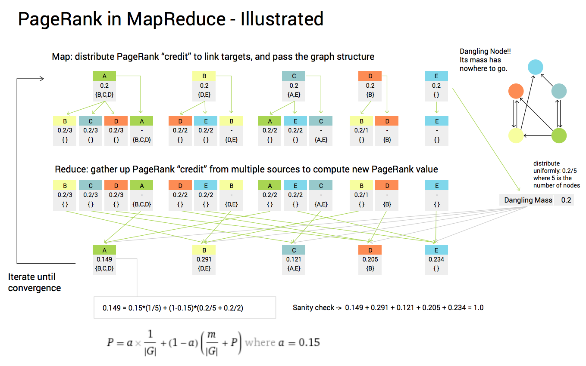
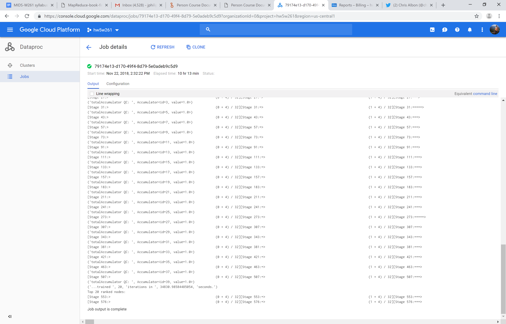

# Spark

The goal of this piece of code is to parallel process 2GB of Wikipedia links, and by understanding the relationships between nodes in the Wikipedia network, to identify the most popular webpages. To accomplish this task, I evaluated the data with the pageRank algorithm and processed it on GCP cluster. At the end, the most prominent page links in the network should have the highest probability allocated to them.

The dataset is stored on a HDFS in a series of txt files with the following format:

2	{'3': 3}

3	{'2': 1}

4	{'1': 1, '2': 1}

5	{'4': 1, '2': 1, '6': 1}

where each row is a webpage link and the dictionary shows the outbound traffic to other webpages and their corresponding ids.

The diagram below is an overview of the math required to iterate over the network graph recursively. Each time the algorithm runs probability is allocated to each page's children. The algorithm also takes into account dangling nodes (or dead-end web pages) where the user will teleport to someone else in the network so each node gets an even piece of the mass on the next iteration.  Due to the large size of the dataset, I work with Spark RDDs and data dictionaries with the following critical format: (node_id , (score, edges)) to facilitate the heavy workload.

I was able to successfully deploy the program on Google Cloud Platform so the training job could run on several slave nodes. Accurately translating a complex math equation across several machines is very challenging so to ensure accuracy I have an accumulator to track the total sum of the probabilities, and as you can see below, it returns 1.00 total probability each iteration as desired. This is a slight deviation from an ideally stateless architecture, but it’s a vital testing step.

The CSV shows the final output of which nodes have the highest probability within the link network.

If you are interested in learning more, here is the link to Larry & Serge's orginal paper from 1998:

http://ilpubs.stanford.edu:8090/422/1/1999-66.pdf
